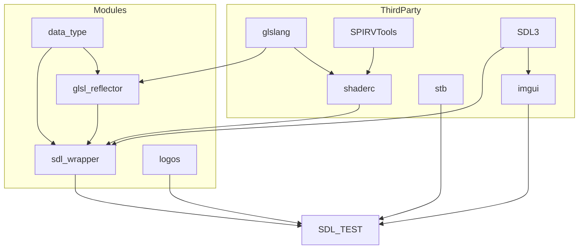

# SDL Test

This is a personal learning project following [Learn OpenGL](https://learnopengl.com/)

## Module

## Track

- [ ] Getting started
    - [x] OpenGL
    - [x] Creating a window
    - [x] Hello Window
    - [x] Hello Triangle
    - [x] Shaders
    - [x] Textures
    - [x] Transformations
    - [ ] Coordinate Systems
    - [ ] Camera
- [ ] Lighting
- [ ] Model Loading
- [ ] Advanced OpenGL
- [ ] Advanced Lighting
- [ ] PBR
- [ ] In Practice
