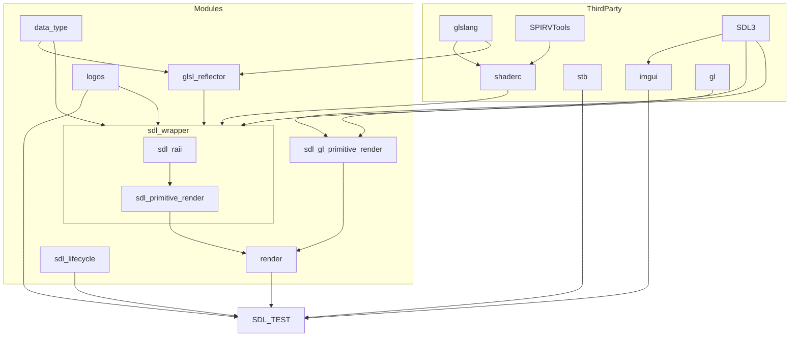

# SDL Test

This is a personal learning project following [Learn OpenGL](https://learnopengl.com/)

## Module

```mermaid
graph TD

    subgraph ThirdParty
        glslang
        shaderc
        SPIRVTools
        SDL3
        stb
        imgui
        gl
    end

    subgraph Modules
        data_type
        glsl_reflector
        sdl_wrapper
        logos
        render
        sdl_gl_primitive_render
        sdl_lifecycle
    end
    
    subgraph sdl_wrapper
        sdl_raii
        sdl_primitive_render
    end

    glslang --> shaderc
    SPIRVTools --> shaderc

    SDL3 --> imgui

    glslang --> glsl_reflector
    data_type --> glsl_reflector

    logos --> sdl_wrapper
    shaderc --> sdl_wrapper
    SDL3 --> sdl_wrapper
    glsl_reflector --> sdl_wrapper
    data_type --> sdl_wrapper
    
    sdl_raii --> sdl_primitive_render
    
    gl --> sdl_gl_primitive_render
    SDL3 --> sdl_gl_primitive_render
    
    sdl_primitive_render --> render
    sdl_gl_primitive_render --> render
    

    sdl_lifecycle --> SDL_TEST
    render --> SDL_TEST
    imgui --> SDL_TEST
    stb --> SDL_TEST
    logos --> SDL_TEST
```

## Track

- [x] Getting started
    - [x] OpenGL
    - [x] Creating a window
    - [x] Hello Window
    - [x] Hello Triangle
    - [x] Shaders
    - [x] Textures
    - [x] Transformations
    - [x] Coordinate Systems
    - [x] Camera
- [ ] Lighting
    - [x] Colors
    - [x] Basic Lighting
    - [ ] Materials
    - [ ] Lighting maps
    - [ ] Light casters
    - [ ] Multiple lights
- [ ] Model Loading
- [ ] Advanced OpenGL
- [ ] Advanced Lighting
- [ ] PBR
- [ ] In Practice
